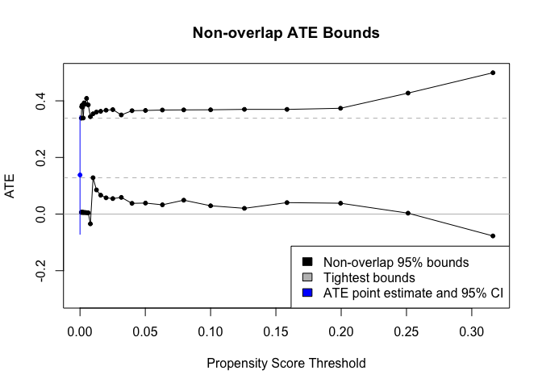

<!-- README.md is generated from README.Rmd. Please edit that file -->

# effectbounds 

<!-- badges: start -->

[](https://github.com/herbps10/effectbounds/actions/workflows/R-CMD-check.yaml)
<!-- badges: end -->

## Overview

The `effectbounds` package provides tools for estimating non-overlap
bounds for causal effects.

The identification of causal effects typically relies on the *overlap
assumption* (also known as *positivity*), which requires that all units
have a positive probability of being in either the treatment or control
group. When overlap is structurally violated, with some units having
zero probability of receiving the treatment (or control), then causal
effects are un-identified. When overlap is practically violated, with
some units having very small probability of receiving the treatment (or
control), then traditional causal inference estimators may have poor
finite-sample performance.

Non-overlap bounds are an approach for estimating causal effects even
when non-overlap is violated, by focusing on estimating *bounds* on the
effect rather than its precise value.

## Installation

You can install the development version of effectbounds from
[GitHub](https://github.com/herbps10/effectbounds):

``` r
# install.packages("devtools")
devtools::install_github("herbps10/effectbounds")
```

## Example

``` r
library(effectbounds)

dat <- simulate_ate_example(seed = 1, N = 5e2, alpha = 3, beta = 0.1, gamma = 1)

bounds <- bounds_ate(
  dat, 
  X = c("X1", "X2"), A = "A", Y = "Y", 
  thresholds = c(10^seq(-3, -0.5, 0.1)), 
  smoothness = c(0.005)
)

plot(bounds, point_estimate = TRUE, main = "Non-overlap ATE Bounds")
```


